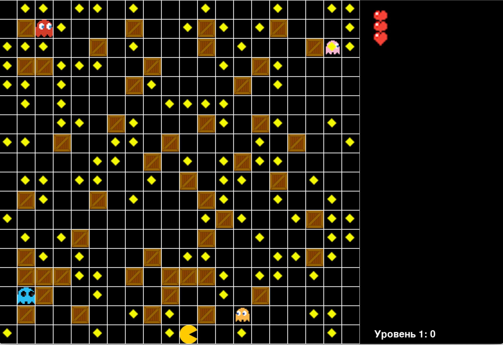

Pacman Project
==============
####Данный проект направлен на создание копии культовой игры "Pac-Man" на клетчатом поле




---
В отличие от реальной игры "Pac-Man", в нашей игре увеличено поле и призраки, которые охотятся за героем, 
двигаются рандомно.
Поле размечено на клетки, герой может проходить сквозь границы поля.
---
### Проект разбит на директории:
* ***data***, в которой хранятся файлы, используемые в программах: изображения и текстовые файлы;
* ***maps***, в которой хранятся стартовая карта и новые карты, которые будут генерироваться;
* ***scripts***, в которой хранятся файлы .py с кодом, который используется в основной программе

Также в проекте есть 2 файла: **main.py**, в котором описана основная программа (функция main).
В функцию main передаются имя файла с картой и номер уровня, который проходит пользователь.

**game.py** - файл, в котором генерируются уровни и передаются в функцию main.
Игровой цикл построен так, что уровни генерируются бесконечно, и игра будет идти пока не будет закрыто окно 
или пользователь не проиграет.
---
В директории `data` можно выделить файлы:
1. **coin.txt** - в нем хранятся очки, которые зарабатывает игрок. Значение обнуляется при начале игры или новом уровне.
2. **life.txt** - в нем хранится количество жизней, которые есть у игрока.
3. **map_size.txt** - в нем хранятся размеры игрового поля в пикселях.

Все остальные файлы в директории - изображения, используемые в игре.

В директории `maps` содержатся всего 2 файла: **first_map.txt** и **new_map.txt**.
В первом файле содержится написанная вручную карта первого уровня; во втором - карта, которая будет генерироваться программно.

В директории `scripts` содержатся 9 файлов, содержащие функции и классы для корректной работы программы. Стоит отметить несколько из них:
1. **generate_map.py** - содержит функцию, которая генерирует уровни, ей передаются ***название файла***,
***длина строки***, ***количество строк*** и необязательный параметр ***coin***, который обозначает 
максимальное количество блоков на одной строке. Карта генерируется с помощью библиотеки `random`, встроенной в python.
2. **load_im.py** - содержит функцию, которая используется во многих файлах для загрузки изображений из директории _data_
3. **draw_setk.py** отвечает за отрисовки клеток на поле.
---
###Функционал игры
В момент начала игры или перехода на новый уровень, герой появляется в центре нижней строки.
4 призрака, соответственно, появляются в 4-х углах карты.

Сам Pac-Man двигается при нажатии одной из кнопок _вверх-вниз-влево-вправо_
Если герой пытается пройти через границу поля, ему это удается и он появляется на противоположной стороне.
Pac-Man не может двигаться через блоки, установленные на карте.

Управлять духами пользователь не может, они двигаются рандомно в любых направлениях.
Они, также, не могут проходить через блоки.

Когда Pac-Man касается любого духа, он возвращается в исходную точку, призраки возвращаются в свои углы и начинают двигаться.
При этом у героя уменьшается количество жизней на 1.

В правой части игрового окна изображены сердца, обозначающие количество оставшихся жизней;
в нижней части отображается номер уровня и количество очков на этом уровне, которые собрал Pac-Man.
За каждую точку, собранную героем, начисляется 1 очко, которое записывается в файл и отображается на экране.
Когда Pac-Man собрал все точки, уровень считается пройденным. Генерируется следующий уровень и начинается новый игровой цикл.
---
### Для работы с проектом необходимо установить библиотеку pygame
```
pip install pygame
```

